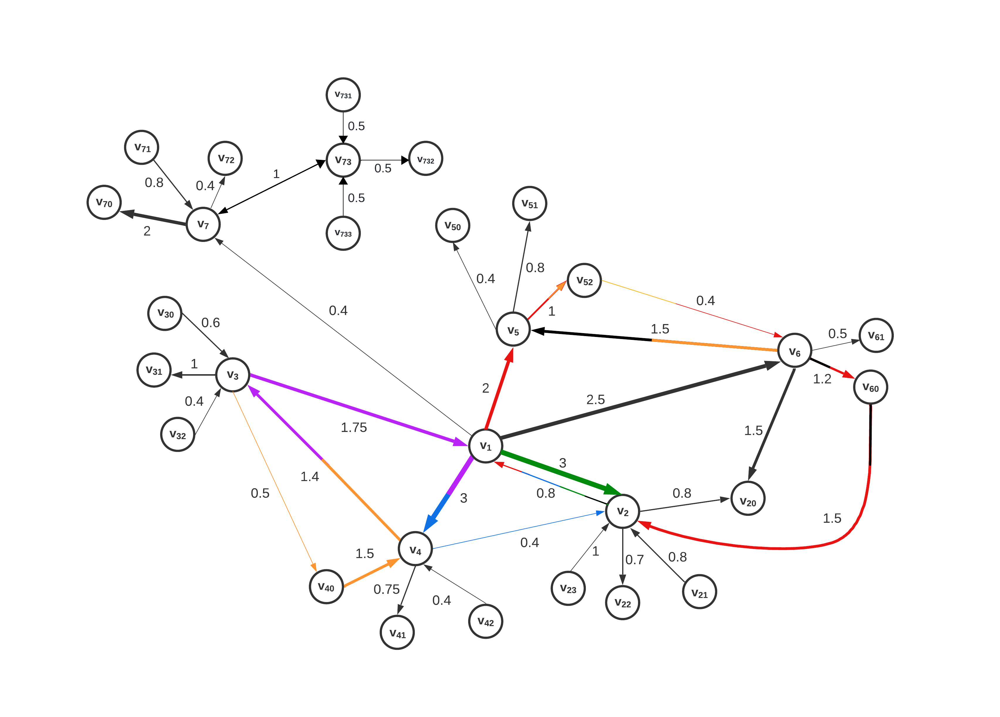

# Semi-Local-Integration-Measure-For-Directed-and-Weighted-Graphs
We propose a semi-local centrality measure for directed and weighted graphs, which takes into account the property of integration of nodes in the clustered neighbourhood of directed complex networks through (directed) interconnectivity between the clustered nodes.

# Example of usage

## Introducing functions 
```

import networkx as nx
from matplotlib import pyplot as plt

def count_cycles_containing_edges(G):
    cycles = list(nx.simple_cycles(G))
    edge_cycle_count = {edge: 0 for edge in G.edges()}
    for edge in G.edges():
        for cycle in cycles:
            # Consider both directions for undirected comparison, if needed
            cycle_edges = list(zip(cycle, cycle[1:] + cycle[:1])) + list(zip(cycle[-1:] + cycle[:-1], cycle))
            if edge in cycle_edges:
                edge_cycle_count[edge] += 1
        # Increment the count for each edge by 1 after checking all cycles
        edge_cycle_count[edge] += 1
    return edge_cycle_count

def calculate_node_strengths(G):
    out_strength, in_strength = {}, {}
    for node in G.nodes:
        out_strength[node] = sum(G[node][succ]['weight'] for succ in G.successors(node))
        in_strength[node] = sum(G[pred][node]['weight'] for pred in G.predecessors(node))
    return in_strength, out_strength

def bracket(node, in_strength, out_strength):
    return in_strength[node] + out_strength[node]

def calculate_importance(G, edge_cycle_count, in_strength, out_strength):
    importance_scores = {}
    for node in G.nodes():
        product = 0
        for x in list(G.successors(node)) + list(G.predecessors(node)):
            edge = (node, x) if (node, x) in G.edges else (x, node)
            cycle_count = edge_cycle_count[edge] if edge in edge_cycle_count else 0
            factor = bracket(node, in_strength, out_strength) + bracket(x, in_strength, out_strength) - 2 * G.get_edge_data(*edge)['weight']
            w = G.get_edge_data(*edge)['weight']
            omjer = bracket(node, in_strength, out_strength) / (bracket(node, in_strength, out_strength) + bracket(x, in_strength, out_strength))
            partial_umnozak = (cycle_count + 1) * factor * w * omjer
            product += partial_umnozak

        # Now, calculate the degrees sum and adjust the total umnozak
        strength_sum = in_strength[node] + out_strength[node]
        adjusted_umnozak = product + strength_sum
        
        importance_scores[node] = adjusted_umnozak  # Store the adjusted umnozak for normalization
        
        # Print the total umnozak and adjusted umnozak for each node
        print(f"Total umnozak for Node {node}: {product}")
        print(f"Total umnozak for Node {node} + in-degree + out-degree: {adjusted_umnozak}\n")

    # Normalize the scores
    suma = sum(importance_scores.values())
    normalized_scores = {node: score / suma * 100 for node, score in importance_scores.items()}
    return normalized_scores
``` 
## Construct a graph G and calculate sli_importance for nodes in the directed graph G
```

# construct an example graph G
def main():
    G = nx.DiGraph()
    weighted_edges = [
        (1, 2, 3), (1, 4, 3), (1, 5, 2), (1, 6, 2.5), (1, 7, 0.4), (2, 1, 0.8), (2, 20, 0.8),
        (2, 22, 0.7), (3, 1, 1.75), (3, 31, 1), (3, 40, 0.5), (4, 3, 1.4), (4, 41, 0.75),
        (4, 2, 0.4), (5, 52, 1), (5, 51, 0.8), (5, 50, 0.4), (6, 5, 1.5), (6, 20, 1.5),
        (6, 61, 0.5), (6, 60, 1.2), (7, 72, 0.4), (7, 70, 2), (21, 2, 0.8), (23, 2, 1),
        (32, 3, 0.4), (30, 3, 0.6), (40, 4, 1.5), (42, 4, 0.4), (52, 6, 0.4), (60, 2, 1.5),
        (71, 7, 0.8), (7, 73, 1), (73, 7, 1), (73, 732, 0.5), (731, 73, 0.5), (733, 73, 0.5)
    ]
    G.add_weighted_edges_from(weighted_edges)

    edge_cycle_count = count_cycles_containing_edges(G)
    in_strength, out_strength = calculate_node_strengths(G)
    importance_scores = calculate_importance(G, edge_cycle_count, in_strength, out_strength)

    for node, score in importance_scores.items():
        print(f"Node {node} importance score: {score} %")   

# Execute the main function
main()

```

## SLI Example output normalized
```
Node 1 importance score: 39.06876049236025 %
Node 2 importance score: 14.367520599359581 %
Node 4 importance score: 11.37623831510284 %
Node 5 importance score: 6.060546847292354 %
Node 6 importance score: 10.563938342726901 %
Node 7 importance score: 4.351379537406043 %
Node 20 importance score: 0.7794791918295874 %
Node 22 importance score: 0.11679680085826352 %
Node 3 importance score: 6.02928869823601 %
Node 31 importance score: 0.18207758452133657 %
Node 40 importance score: 0.8161203281372492 %
Node 41 importance score: 0.1267149104564801 %
Node 52 importance score: 0.5665725921980302 %
Node 51 importance score: 0.13398100245991168 %
Node 50 importance score: 0.051471655436647834 %
Node 61 importance score: 0.07122722335777971 %
Node 60 importance score: 1.874020289134723 %
Node 72 importance score: 0.051418557661858245 %
Node 70 importance score: 0.43949761781012275 %
Node 21 importance score: 0.14203519302705178 %
Node 23 importance score: 0.19737438472563698 %
Node 32 importance score: 0.05144532596154555 %
Node 30 importance score: 0.08971121265129565 %
Node 42 importance score: 0.052181880449756836 %
Node 71 importance score: 0.13360727581427734 %
Node 73 importance score: 2.1073219256764566 %
Node 732 importance score: 0.06642407178266628 %
Node 731 importance score: 0.06642407178266628 %
Node 733 importance score: 0.06642407178266628 %
```
## Graph G

